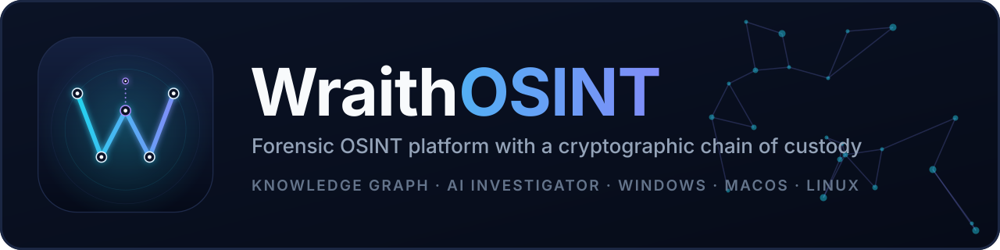
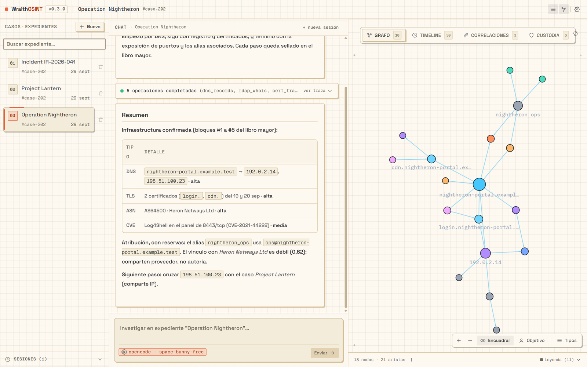
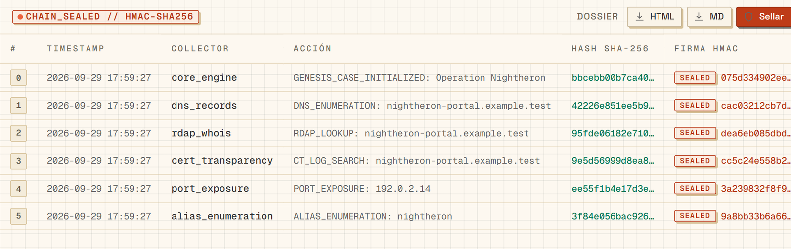
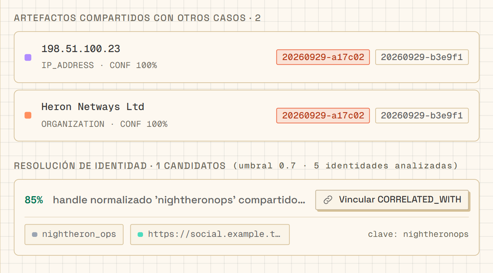
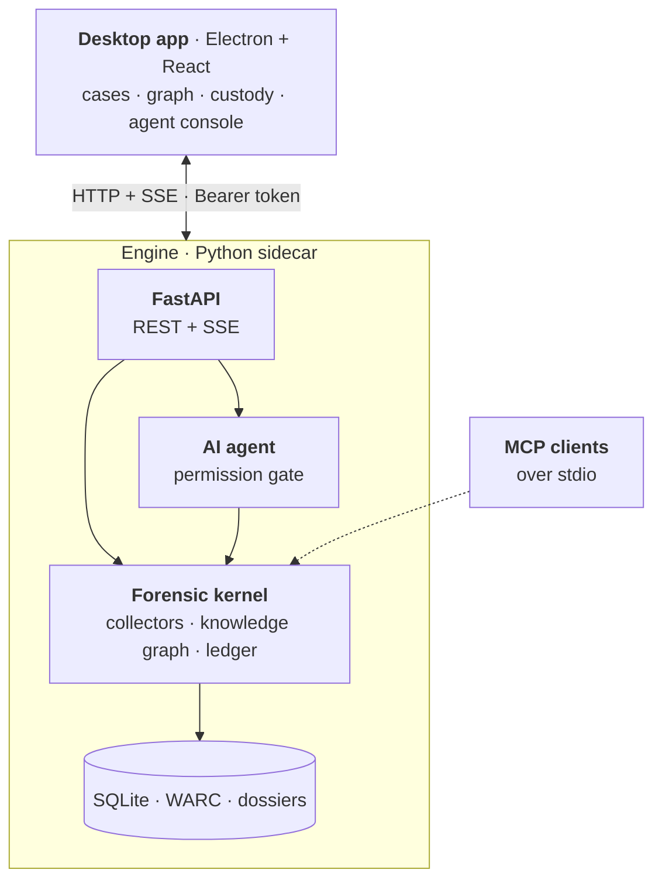

<div align="center">



<br>

[](https://github.com/iwiels/osint/actions/workflows/ci.yml)
[](https://github.com/iwiels/osint/releases/latest)
[](LICENSE)
[](pyproject.toml)
[](package.json)
[](#download)

**[Download](#download)** · **[Quick start](#quick-start)** · **[Features](#features)** · **[Architecture](#architecture)** · **[Contributing](CONTRIBUTING.md)** · **[Security](SECURITY.md)**

</div>

<p align="center">
  
  <br>
  <sub>The desktop console with a fictional demo case. The interface is currently in Spanish.</sub>
</p>

> [!WARNING]
> **Responsible use.** WraithOSINT collects information from open sources and
> includes dual-use capabilities (TLS impersonation, a stealth browser, and
> opt-in account enumeration). Use it only when you have a lawful basis and a
> legitimate purpose, such as journalism, incident response, threat intelligence,
> human rights work, or due diligence. It is not intended for stalking, doxing,
> or non-consensual surveillance. Read [LEGAL.md](LEGAL.md) before use.

## Why WraithOSINT

An investigation is only as strong as the evidence behind it. WraithOSINT keeps
collection, analysis, and custody in one place:

- **Evidence you can defend.** Every collector result is appended to a per-case
  SHA-256 hash chain and sealed with a local HMAC key, and web captures are
  stored as WARC 1.1 for replay. Editing a past block breaks the chain and fails
  verification. [LEGAL.md](LEGAL.md) explains what the chain does and does not prove.
- **From artifacts to relationships.** Entities land in a knowledge graph with a
  timeline, cross-case correlation, and explainable identity resolution.
- **An AI investigator that asks first.** A multi-provider agent runs the
  collectors for you. Sensitive actions go through an analyst permission dialog,
  and direct API calls are stopped by a fail-closed permission gate.
- **Open by design.** The engine is a headless service (REST + SSE with OpenAPI
  docs) and an MCP server, so scripts, CI, and other MCP clients can drive it too.

## Features

| Area | What you get |
|---|---|
| **Collection** | DNS and passive DNS, TLS and Certificate Transparency, RDAP/WHOIS, attack surface and port exposure, subdomain takeover, cloud buckets, threat-intel feeds, breach data, blockchain, company registries, GitHub forensics, document forensics, and username sweeps across 700+ sites ([WhatsMyName](https://github.com/WebBreacher/WhatsMyName)). Collectors that need an API key are skipped silently without one. |
| **Transport** | `curl_cffi` with Chrome TLS-fingerprint impersonation and a stealth browser (`patchright`) for sites that reject plain HTTP clients. |
| **Chain of custody** | Hash-chained, HMAC-sealed ledger per case with a signed head anchor and attestations. WARC 1.1 captures come with a manifest that flags missing or truncated bodies. |
| **Analysis** | Knowledge graph, timeline, cross-case correlation, explainable Fellegi-Sunter link scoring (not yet empirically calibrated), Admiralty-inspired scoring helpers, and solar shadow timing windows in UTC. |
| **Reporting** | Case dossiers as HTML and Markdown from the console, and as STIX 2.1 through the engine. |
| **AI agent** | Anthropic, OpenAI, OpenCode Zen (free models with automatic rate-limit retries), Ollama (local), and any OpenAI-compatible endpoint, plus investigation playbooks the agent can load. |
| **Interfaces** | Desktop console (Electron + React), REST + SSE API, an MCP server over stdio with 47 tools, and a typed TypeScript client, `@wraith/sdk`. |

## A quick tour

**Chain of custody.** Each step of an investigation becomes a block in the case
ledger, with its SHA-256 hash and HMAC signature, so the whole history can be
verified and exported.

<p align="center">
  
</p>

**Cross-case correlation.** Artifacts shared between cases surface automatically,
and identity-resolution candidates are scored so you decide what to link.

<p align="center">
  
</p>

## Download

Installers for Windows, macOS, and Linux are attached to every
[release](https://github.com/iwiels/osint/releases/latest). The engine is bundled
with the app, so **Python is not required**.

| Platform | Package | Notes |
|---|---|---|
| **Windows** (x64) | `WraithOSINT-<version>-win-x64-setup.exe` | Per-user installer, no admin rights needed |
| **macOS** (Apple Silicon) | `WraithOSINT-<version>-mac-arm64.dmg` | Also available as `.zip`. Not signed or notarized yet |
| **macOS** (Intel) | `WraithOSINT-<version>-mac-x64.dmg` | Also available as `.zip`. Not signed or notarized yet |
| **Linux** (x64) | `WraithOSINT-<version>-linux-x86_64.AppImage` | Portable, runs on most distributions |
| **Linux** (x64) | `WraithOSINT-<version>-linux-amd64.deb` | Debian and Ubuntu package |

<details>
<summary><b>First launch</b>: the installers are not code-signed yet</summary>

- **Windows:** SmartScreen may show a warning. Choose **More info → Run anyway**.
- **macOS:** open the app once, then allow it in **System Settings → Privacy & Security**
  (**Open Anyway**). Frictionless distribution needs a Developer ID certificate and
  notarization (see the [roadmap](ARCHITECTURE.md#roadmap)).
- **Linux:** make the AppImage executable with `chmod +x`, or install the package with
  `sudo apt install ./WraithOSINT-<version>-linux-amd64.deb`.

</details>

Your cases, dossiers, and ledger key live outside the app bundle, in the platform's
application data directory (`%APPDATA%` on Windows, `~/Library/Application Support`
on macOS, `~/.config` on Linux), so they survive updates.

## Quick start

Run from source on Windows, macOS, or Linux. You need **Node.js 22+** and **Python 3.11+**.

```bash
git clone https://github.com/iwiels/osint.git
cd osint

npm ci        # installs JS dependencies and prepares the engine virtual environment
npm run dev   # starts the desktop app; the engine starts automatically
```

If the postinstall step could not install the engine dependencies, install them
in the engine virtual environment:

```bash
# Windows
engine\.venv\Scripts\python.exe -m pip install -r engine\requirements.txt

# macOS / Linux
engine/.venv/bin/python -m pip install -r engine/requirements.txt
```

### Configuration

API keys are optional. Add them in the app under **Settings → Credentials**, which
stores them in a local vault with `0600` permissions, or export the variables listed
in [`.env.example`](.env.example). The engine reads the process environment and does
**not** load a `.env` file automatically.

## Architecture



The desktop app starts the engine as a sidecar and talks to it over authenticated
HTTP and Server-Sent Events. The same engine also runs on its own and as an MCP
server. See [ARCHITECTURE.md](ARCHITECTURE.md) for details and design decisions.

### Run the engine without Electron

The engine can run on its own for CI, servers, and scripts.

```bash
# bash or zsh: create a token for this shell session and start the engine
export SPECTER_ENGINE_TOKEN=$(python -c "import secrets; print(secrets.token_hex(32))")
python -m engine.http_server --port 8787
```

```bash
# in another terminal, reuse the same token
curl -H "Authorization: Bearer $SPECTER_ENGINE_TOKEN" http://127.0.0.1:8787/cases
curl -N "http://127.0.0.1:8787/events?token=$SPECTER_ENGINE_TOKEN"
```

```powershell
# PowerShell equivalent
$env:SPECTER_ENGINE_TOKEN = python -c "import secrets; print(secrets.token_hex(32))"
python -m engine.http_server --port 8787
curl.exe -H "Authorization: Bearer $env:SPECTER_ENGINE_TOKEN" http://127.0.0.1:8787/cases
```

Interactive API docs (Swagger UI) are served at `http://127.0.0.1:8787/docs`.

### Use the agent API

```bash
curl -X POST http://127.0.0.1:8787/agent/run \
  -H "Authorization: Bearer $SPECTER_ENGINE_TOKEN" \
  -H "Content-Type: application/json" \
  -d '{
    "case_id": "case-20260929-000001",
    "message": "Investigate example.com and enumerate subdomains",
    "provider": "anthropic"
  }'
```

Sensitive tools emit `permission.request` over SSE. The analyst answers with
`POST /agent/permissions/respond {request_id, decision}`.

### Use the tools from an MCP client

The same tools are available over stdio. Copy
[`mcp_config.json.example`](mcp_config.json.example) into your MCP client's
configuration and replace `<ABSOLUTE_PATH_TO_THIS_REPO>`.

## Development

```bash
npm run verify   # everything CI runs: lint, tests, contract check, typecheck, build
```

Contributions are welcome: see [CONTRIBUTING.md](CONTRIBUTING.md) for the setup, the
definition of done, and the rule that no real investigation data ever enters the repo.

<details>
<summary><b>Build installers locally</b></summary>

```bash
npm run engine:build   # engine binary (PyInstaller one-file)

npm run dist:win       # or dist:mac / dist:linux, for the platform you are on
```

PyInstaller does not cross-compile, so build on the target platform, or push a
`vX.Y.Z` tag and let the [release workflow](.github/workflows/release.yml) build the
native packages on each platform.

</details>

<details>
<summary><b>Scripts</b></summary>

| Command | Action |
|---|---|
| `npm run dev` | Run the Electron app in development mode (starts the engine too) |
| `npm run build` | Build the desktop app for production |
| `npm run typecheck` | Typecheck the SDK and desktop app |
| `npm test` | Run the SDK tests (Vitest) |
| `npm run test:desktop` | Run the desktop renderer tests |
| `npm run lint` | Run Ruff checks and formatting checks for the engine |
| `npm run test:py` | Run the engine's pytest suite |
| `npm run gen:sdk` / `npm run gen:sdk:check` | Generate / verify the SDK types from `/openapi.json` |
| `npm run a11y:contrast` | Check WCAG 2.2 AA color contrast |
| `npm run engine:build` | Package the engine with PyInstaller |
| `npm run smoke:engine` | Run the engine HTTP smoke test |
| `npm run verify` | Run all of the project's release checks |
| `python -m engine.http_server` | Run the standalone engine |

</details>

<details>
<summary><b>Quality gates</b></summary>

Coverage follows a **ratchet** policy ([ADR-004](docs/adr/adr-004-quality-ratchet.md)):
thresholds only increase.

| Gate | Tool | Threshold |
|---|---|---|
| Python lint and formatting | Ruff | No outstanding violations |
| Engine tests | pytest | Coverage ≥ 80% |
| Engine ↔ SDK contract | `gen_sdk_types.py --check` | In sync with `/openapi.json` |
| Color contrast | `a11y-contrast.mjs` | WCAG 2.2 AA |
| TypeScript types | `tsc --noEmit` | Strict |
| SDK tests | Vitest | Coverage gate |
| Desktop renderer tests | Node test runner | All renderer tests |

Architecture decisions are recorded in [docs/adr/](docs/adr/README.md).

</details>

<details>
<summary><b>Repository layout</b></summary>

| Path | Contents |
|---|---|
| `engine/` | Python engine: FastAPI (`http_server.py`), agent (`agent.py`), registry, and forensic kernel (`specter/`) |
| `packages/sdk` | `@wraith/sdk`, the typed TypeScript client (HTTP + SSE) |
| `desktop/` | Electron app (main, preload, and the React renderer) |
| `scripts/` | postinstall, engine build (PyInstaller), smoke tests, and the contrast gate |
| `tests/` | pytest suite for the kernel, agent, and HTTP contract |
| `docs/` | ADRs, agent personas, UI rules, and brand assets |
| `skills/` | Investigation playbooks the agent can load |

</details>

### Naming convention

The product is **WraithOSINT**, while the engine keeps `specter` as its internal
kernel name:

| Scope | Identifier | Example |
|---|---|---|
| Product, UI, installers, docs | `Wraith*` | `WraithOSINT`, `@wraith/sdk`, `WraithClient` |
| Engine binary | `wraith-engine` | `dist-engine/wraith-engine.exe` |
| Python kernel package | `specter` (internal) | `from specter.osint_core import ledger` |
| Environment variables | `SPECTER_*` | `SPECTER_ENGINE_TOKEN`, `SPECTER_DATA_DIR` |

The environment variables and the Python package keep their internal names so that
existing scripts, tests, and deployments keep working. See [`.env.example`](.env.example).

## Status and roadmap

WraithOSINT is an operational desktop platform today: an HTTP/SSE engine, a
multi-provider agent with an analyst permission dialog, a direct-API permission
gate, a knowledge graph, a chain-of-custody ledger, and case dossiers. Direct case
deletion is denied by default (`delete/case:*`) and can be enabled per case with
`add_permission_rule` (`action=delete`, `resource=case:<id>`, `effect=allow`).

Planned work lives in the [architecture roadmap](ARCHITECTURE.md#roadmap):
interactive graph controls (drag, filters, timeline), TAXII integration, team mode,
plugins, and code signing. Review the limitations and responsible-use guidance in
[LEGAL.md](LEGAL.md).

## Credits and third-party data

- The [WhatsMyName dataset](https://github.com/WebBreacher/WhatsMyName) is licensed
  under **Creative Commons Attribution-ShareAlike 4.0 International (CC BY-SA 4.0)**;
  see the embedded attribution in `data/wmn-data.json`.
- Inspired by the client/server pattern in [OpenCode](https://github.com/sst/opencode).
- Built with [curl_cffi](https://github.com/lexiforest/curl_cffi),
  [patchright](https://github.com/Kaliiiiiiiiii-Vinyzu/patchright),
  [warcio](https://github.com/webrecorder/warcio), [NetworkX](https://networkx.org/),
  [FastAPI](https://fastapi.tiangolo.com/), and [Electron](https://www.electronjs.org/).

## License

The project code is licensed under the MIT License; see [LICENSE](LICENSE).
Third-party data and dependencies may have separate licenses. Your use of the
software is your responsibility. [LEGAL.md](LEGAL.md) is part of the project's
design and should be retained when redistributing the project.
